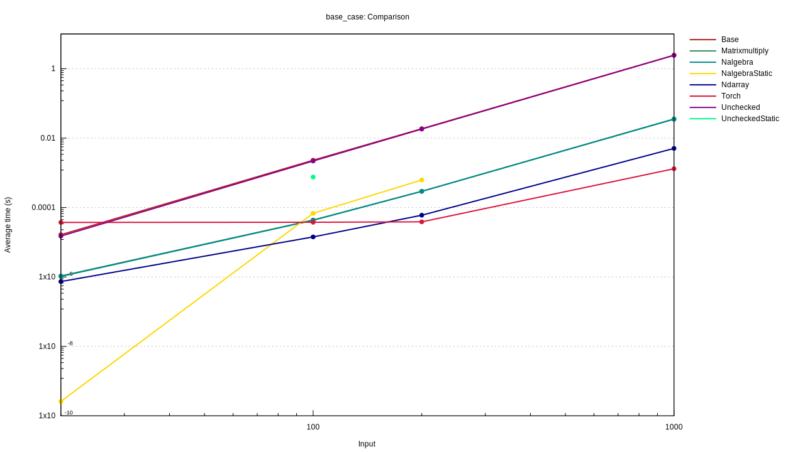
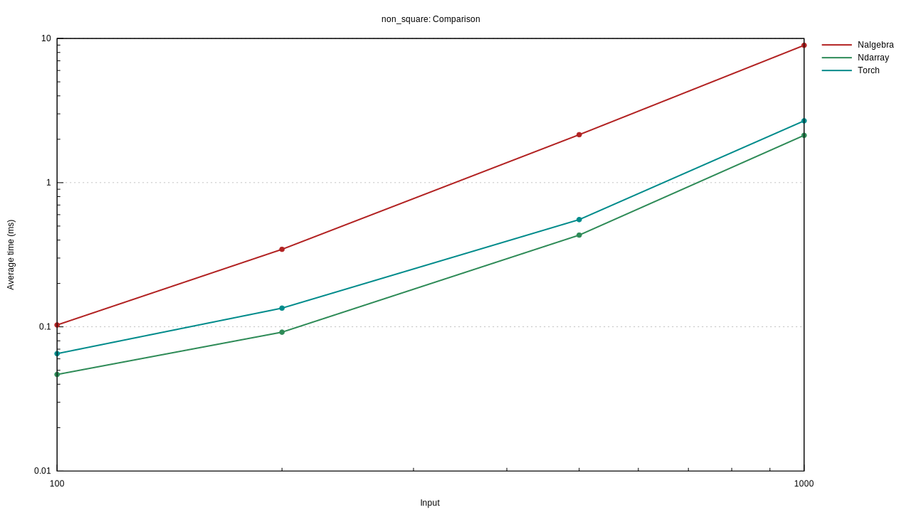
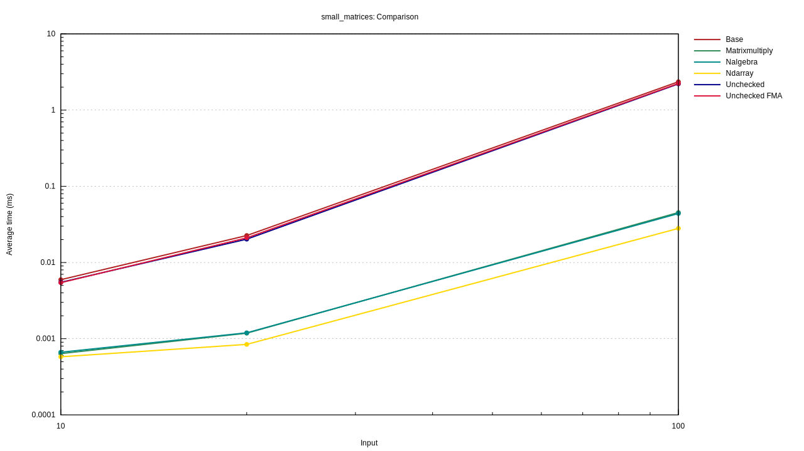
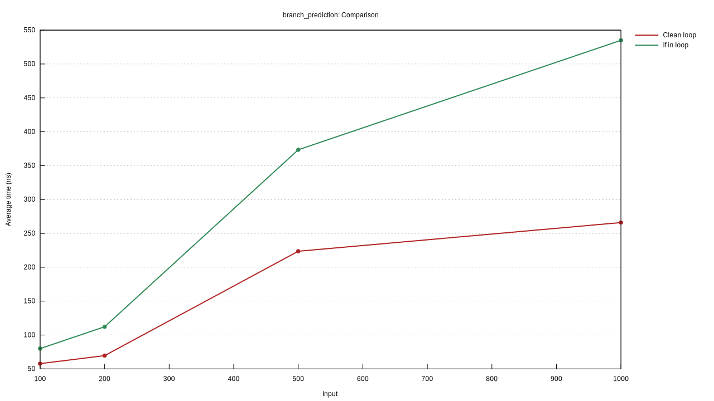

# The Glorious Rust Matrix Multiplication Benchmark (And assorted performance benchmarks)

What's the best way to multiply matrices in Rust? Here's a benchmark of a few libraries.

It should just ran, but needs some setup for torch:
For torch you'll need to do first this

```
export LIBTORCH=~/Downloads/libtorch/
export LD_LIBRARY_PATH=${LIBTORCH}/lib
```

Compile and run with `TORCH_CUDA_VERSION=10.2 RUSTFLAGS="-C target-cpu=native -C codegen-units=1" cargo bench`.

Tested on a Dell XPS 15 Intel(R) Core(TM) i7-8750H CPU @ 2.20GHz (Has up to AVX2). GPU is a 1050 Ti.
Admittedly this test is at least a bit biased against torch; and it would probably excel if we had a real program running more operations.

All things considered, I would recommend ndarray as THE array/linalg crate of choice for the Rust ecosystem (If one is CPU bound).
If however one is doing a lot of smaller matrix multiplications that can fit on the stack, then the statically allocated Nalgebra matrices would be the best.

## What was tested

1. Matrixmultiply (Has just two functions, sgemm and dgemm) using custom kernels rather than the more common BLAS.
2. Ndarray uses OpenBLAS in this benchmark, but other backends can be configured (Like Intel's MKL or Apple's Accelerate framework)
3. Nalgebra depends on matrixmultiply so I assume that at least for some operations it will be using that; accordingly its results were in line with Matrixmultiply (But it is way easier to use, sgemm needs one to use unsafe code.)
4. Base is the regular hand coded matmul algorithm. Nothing fancy here.
5. Unchecked is the same as 4.but using unsafe .get_unchecked() to get some extra speedup. Makes things faster but does not matter much.
6. UncheckedStatic is the same as 5. but using statically allocated arrays instead of Vec. Improves performance somewhat.
7. NalgebraStatic is using statically allocated matrices. This has a limit as the stack is not infinitely large, but performs really well at smaller sizes.
8. Torch is the tch-rs bindings to libtorch, in this case with CUDA enabled.

## Square matrix multiplication (Using nalgebra 0.20)



## N x 200 matrix multiplication (Using nalgebra 0.21)



## Smaller matrices (And including FMA comparison)

Not Full Metal Alchemist, but Fused Add-Multiply, tested this one on a different laptop. FMA doesn't seem to do much here.


## Branch prediction
Iterating over two arrays and summing them, then doing one element differently.
In one case the iteration is done "cleanly" and then one element is changed (So we are actually setting the element twice). In the other case we have an if in the loop and check all the time. The former is faster.


## Simd arrays
Here I compare various ways (defining the exact size of the array vs using a function that doesn't have that knowledge encoded in its type) of doing a simple array operation on u8 unsigned integers. Tldr is that for very long arrays it doesn't matter as much what you do. For smaller arrays, using array (Rather than Vec<>) is faster; and interestingly the timings don't increase linearly, at first it goes up and then down and then up!

